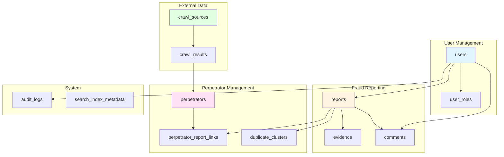
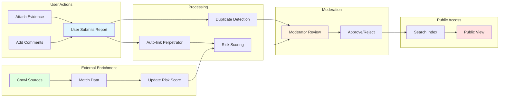
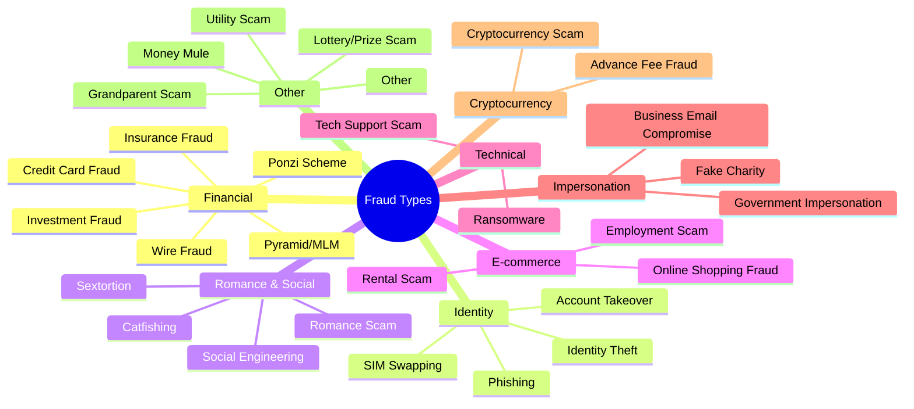
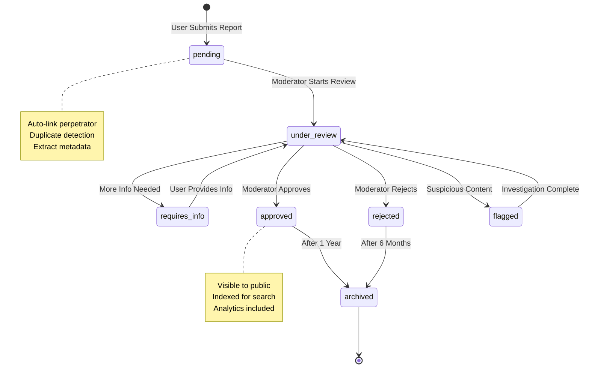
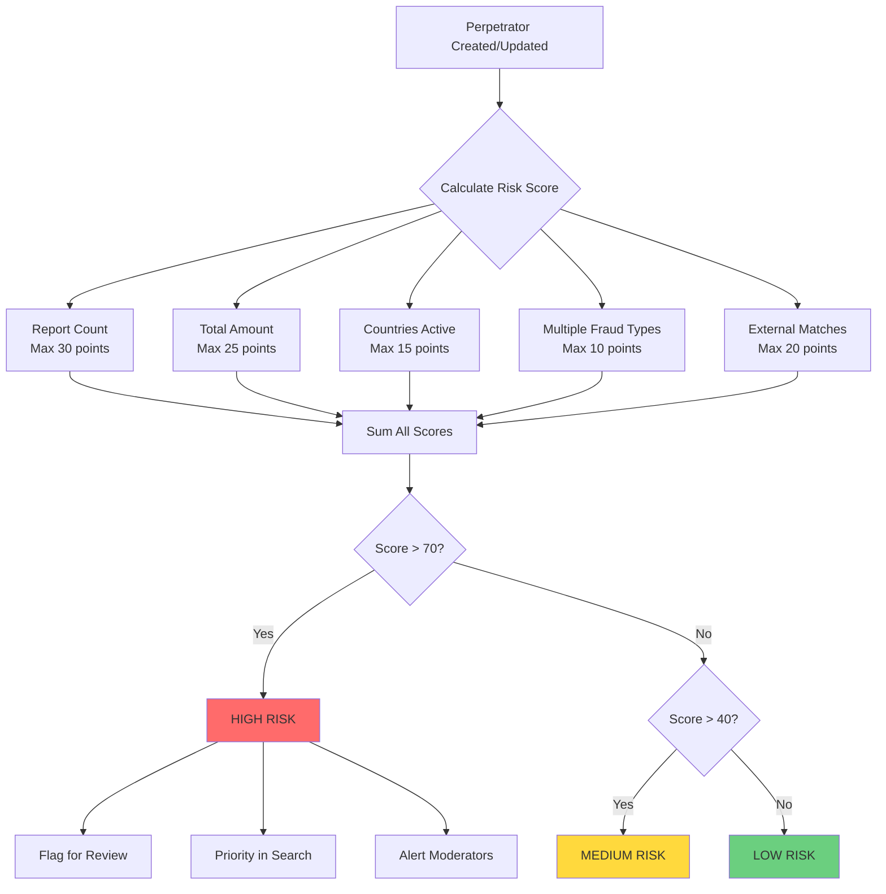
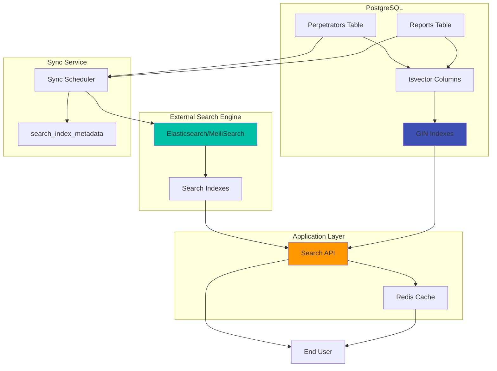

# Scamnemesis Entity Relationship Diagram

## Mermaid ERD

```mermaid
erDiagram
    users ||--o{ reports : "submits"
    users ||--o{ user_roles : "has"
    users ||--o{ comments : "writes"
    users ||--o{ audit_logs : "performs"
    users ||--o{ crawl_sources : "creates"

    reports ||--o{ evidence : "contains"
    reports ||--o{ comments : "has"
    reports ||--o{ perpetrator_report_links : "links_to"
    reports ||--o{ duplicate_clusters : "grouped_in"

    perpetrators ||--o{ perpetrator_report_links : "linked_from"
    perpetrators ||--o{ crawl_results : "matched_in"

    crawl_sources ||--o{ crawl_results : "produces"

    comments ||--o{ comments : "replies_to"

    users {
        uuid id PK
        varchar email UK
        boolean email_verified
        varchar password_hash
        varchar oauth_provider
        varchar oauth_id
        varchar first_name
        varchar last_name
        varchar phone
        varchar country_code
        user_tier tier
        user_status status
        int login_count
        timestamptz last_login_at
        inet last_login_ip
        int failed_login_attempts
        timestamptz locked_until
        timestamptz created_at
        timestamptz updated_at
        timestamptz deleted_at
    }

    user_roles {
        uuid id PK
        uuid user_id FK
        system_role role
        jsonb permissions
        jsonb scope
        uuid granted_by FK
        timestamptz granted_at
        timestamptz expires_at
        timestamptz revoked_at
        uuid revoked_by FK
        text reason
        timestamptz created_at
        timestamptz updated_at
    }

    perpetrators {
        uuid id PK
        varchar canonical_name
        text[] aliases
        text[] emails
        text[] phones
        jsonb[] addresses
        jsonb digital_identifiers
        int risk_score
        jsonb risk_factors
        jsonb payload
        int report_count
        numeric total_amount_reported_usd
        text[] countries_active
        fraud_type[] fraud_types
        boolean pep_match
        boolean sanctions_match
        boolean law_enforcement_reported
        tsvector search_vector
        timestamptz first_reported_at
        timestamptz last_reported_at
        timestamptz verified_at
        uuid verified_by FK
        timestamptz created_at
        timestamptz updated_at
        timestamptz deleted_at
    }

    reports {
        uuid id PK
        uuid user_id FK
        varchar reporter_email
        boolean reporter_anonymous
        fraud_type fraud_type
        report_status status
        report_severity severity
        jsonb payload
        date incident_date
        varchar incident_country
        numeric incident_amount_usd
        varchar perpetrator_name
        varchar perpetrator_email
        varchar perpetrator_phone
        text[] perpetrator_addresses
        tsvector search_vector_en
        text search_vector_content
        uuid reviewed_by FK
        timestamptz reviewed_at
        text review_notes
        text rejection_reason
        uuid duplicate_cluster_id
        boolean is_duplicate
        uuid duplicate_of FK
        boolean is_public
        boolean is_verified
        int view_count
        int search_hits
        timestamptz submitted_at
        timestamptz created_at
        timestamptz updated_at
        timestamptz archived_at
        timestamptz deleted_at
    }

    perpetrator_report_links {
        uuid id PK
        uuid report_id FK
        uuid perpetrator_id FK
        numeric confidence_score
        varchar link_type
        text[] matched_on
        timestamptz created_at
        uuid created_by FK
    }

    evidence {
        uuid id PK
        uuid report_id FK
        evidence_type type
        varchar filename
        varchar mime_type
        bigint file_size_bytes
        varchar s3_bucket
        varchar s3_key
        varchar s3_region
        text storage_url
        evidence_status status
        varchar checksum_sha256
        jsonb virus_scan_result
        timestamptz virus_scanned_at
        boolean is_public
        boolean requires_authentication
        jsonb metadata
        text extracted_text
        varchar thumbnail_s3_key
        text url
        varchar url_screenshot_s3_key
        timestamptz uploaded_at
        timestamptz created_at
        timestamptz updated_at
        timestamptz deleted_at
    }

    comments {
        uuid id PK
        uuid report_id FK
        uuid user_id FK
        text content
        text content_html
        uuid parent_comment_id FK
        int thread_depth
        comment_status status
        boolean is_internal
        int flagged_count
        uuid moderated_by FK
        timestamptz moderated_at
        text moderation_reason
        int upvotes
        int helpful_count
        timestamptz created_at
        timestamptz updated_at
        timestamptz edited_at
        timestamptz deleted_at
    }

    duplicate_clusters {
        uuid id PK
        uuid canonical_report_id FK
        uuid[] report_ids
        numeric similarity_score
        jsonb match_criteria
        boolean reviewed
        uuid reviewed_by FK
        timestamptz reviewed_at
        boolean confirmed
        timestamptz created_at
        timestamptz updated_at
    }

    crawl_sources {
        uuid id PK
        varchar name UK
        crawl_source_type source_type
        text description
        text base_url
        text url_pattern
        text api_endpoint
        jsonb config
        crawl_frequency frequency
        boolean requires_auth
        jsonb auth_config
        boolean is_active
        timestamptz last_crawl_at
        timestamptz last_success_at
        text last_error
        int consecutive_failures
        int rate_limit_per_hour
        int reliability_score
        timestamptz created_at
        timestamptz updated_at
        uuid created_by FK
    }

    crawl_results {
        uuid id PK
        uuid source_id FK
        uuid perpetrator_id FK
        jsonb raw_data
        jsonb normalized_data
        crawl_result_status status
        numeric match_score
        text[] match_fields
        text source_url
        text source_title
        date source_date
        text extracted_text
        jsonb entities_found
        timestamptz crawled_at
        timestamptz processed_at
        timestamptz created_at
        timestamptz updated_at
        varchar content_hash
    }

    audit_logs {
        uuid id PK
        uuid user_id FK
        varchar user_email
        system_role user_role
        audit_action action
        varchar entity_type
        uuid entity_id
        jsonb details
        jsonb old_values
        jsonb new_values
        inet ip_address
        text user_agent
        varchar request_id
        boolean success
        text error_message
        timestamptz created_at
    }

    search_index_metadata {
        uuid id PK
        search_index_type index_type
        varchar index_name
        varchar entity_type
        sync_status status
        timestamptz last_sync_started_at
        timestamptz last_sync_completed_at
        text last_sync_error
        bigint total_documents
        bigint synced_documents
        bigint failed_documents
        jsonb mapping
        jsonb settings
        uuid last_synced_id
        timestamptz last_synced_timestamp
        timestamptz created_at
        timestamptz updated_at
    }
```

## Simplified Core Entity Diagram

## Data Flow Diagram

## Fraud Type Categories

## Report Lifecycle

## Perpetrator Risk Scoring

## Search Architecture

